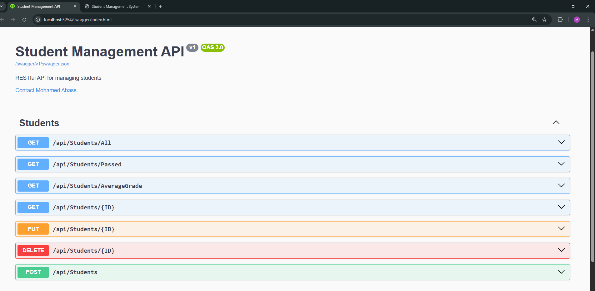
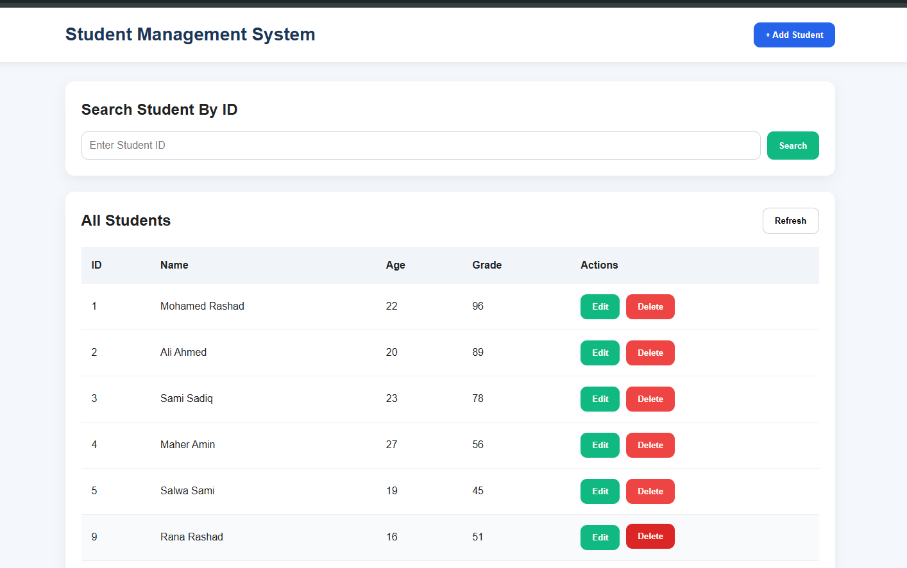
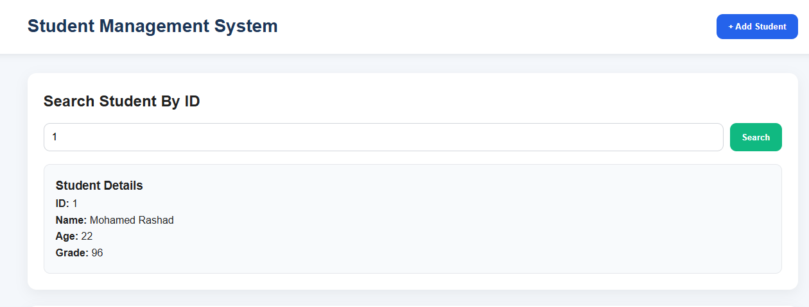

 # 🎓 Students Management System | ASP.NET Core REST API + Desktop & Web Clients

A complete full-stack Students Management System built using:

* ASP.NET Core REST API
* Layered Architecture
* SQL Server
* Windows Forms Desktop Client
* Web Frontend Client
* ADO.NET
* Stored Procedures
* Async Programming

This project demonstrates how modern applications are built using a clean separation between:

* Backend API
* Business Logic
* Data Access Layer
* Frontend Clients

---

# 📁 Project Structure

```text
Students Project
│
├── Backend
│   ├── StudentApi
│   ├── StudentAPIBusinessLayer
│   ├── StudentDataAccessLayer
│   └── Backend.sln
│
└── Frontend
    ├── StudentDesktopClient1
    └── StudentsWebClient
```

---

# 🏗️ Architecture

The backend follows a Layered Architecture approach.

```text
Client Applications
        ↓
ASP.NET Core REST API
        ↓
Business Layer
        ↓
Data Access Layer
        ↓
SQL Server Database
```

---

# 🚀 Technologies Used

## Backend

* ASP.NET Core Web API
* C#
* ADO.NET
* SQL Server
* Stored Procedures
* RESTful API
* Async/Await
* Layered Architecture

## Frontend

### Desktop Application

* Windows Forms
* HttpClient
* REST API Consumption

### Web Application

* HTML
* CSS
* JavaScript
* Fetch API

---

# ✨ Features

## Backend API Features

* Get all students
* Get student by ID
* Add new student
* Update student
* Delete student
* Proper HTTP Status Codes
* DTO Pattern
* Async Database Operations
* Stored Procedures
* Business Layer Separation

---

# 🖥️ Desktop Client Features

* Display students list
* Add new student
* Update student
* Delete student
* Find student by ID
* REST API integration using HttpClient
* Async operations

---

# 🌐 Web Client Features

* Responsive UI
* Display students table
* Add students
* Update students
* Delete students
* Search by ID
* REST API integration using Fetch API

---

# 📸 Screenshots

## 🔹 Swagger API Documentation

The ASP.NET Core API is fully documented using Swagger UI.



---

## 🔹 Desktop Client

Windows Forms desktop application connected to the REST API.

### Students Dashboard



---

## 🔹 Web Client

Responsive web frontend built using HTML, CSS, and Vanilla JavaScript.

### Dashboard Page


### Search Student By ID



# 📡 REST API Endpoints

## Base URL

```text
http://localhost:5254/api/Students/
```

---

## Get All Students

```http
GET /All
```

---

## Get Student By ID

```http
GET /{id}
```

---

## Add New Student

```http
POST /
```

### Request Body

```json
{
  "name": "Ali",
  "age": 20,
  "grade": 90
}
```

---

## Update Student

```http
PUT /{id}
```

### Request Body

```json
{
  "name": "Ali",
  "age": 21,
  "grade": 95
}
```

---

## Delete Student

```http
DELETE /{id}
```

---

# 🗄️ Database

The project uses:

* SQL Server
* Stored Procedures
* Identity Columns
* Output Parameters
* Async Database Access

### Example Stored Procedures

* `SP_GetAllStudents`
* `SP_GetStudentByID`
* `SP_AddNewStudent`
* `SP_UpdateStudent`
* `SP_DeleteStudent`

---

# 🧠 Important Concepts Applied

This project applies many important backend engineering concepts:

* RESTful API Design
* Layered Architecture
* DTO Pattern
* Separation of Concerns
* Async Programming
* Client-Server Architecture
* HTTP Status Codes
* Serialization & Deserialization
* CRUD Operations
* API Consumption

---

# ⚙️ How To Run The Project

## 1. Clone Repository

```bash
git clone <YOUR_REPOSITORY_URL>
```

---

## 2. Setup Database

* Create SQL Server database
* Execute the SQL scripts
* Create tables and stored procedures

---

## 3. Configure Connection String

Update the connection string inside:

```text
StudentDataAccessLayer
```

Example:

```csharp
private static string _ConnectionString =
"Server=.;Database=StudentDB1;User Id=sa;Password=123456;Encrypt=False;TrustServerCertificate=True;Connection Timeout=30;";
```

---

## 4. Run Backend API

Open:

```text
Backend.sln
```

Run:

```text
StudentApi
```

---

## 5. Run Frontend Applications

### Desktop Client

Run:

```text
StudentDesktopClient1
```

### Web Client

Open:

```text
StudentsWebClient/index.html
```

---

# 📚 Learning Goals Of This Project

This project was built for learning and practicing:

* Full-stack development
* REST APIs
* Backend architecture
* API consumption
* Desktop and Web frontend integration
* Database interaction using ADO.NET
* Clean project organization

---

# 🔮 Possible Future Improvements

* JWT Authentication
* Role-Based Authorization
* Entity Framework Core
* Logging
* Global Exception Handling
* File Uploads
* Pagination


---

# 👨‍💻 Author

Developed by Mohamed Abass.

---

# 📄 License

This project is for educational purposes.
